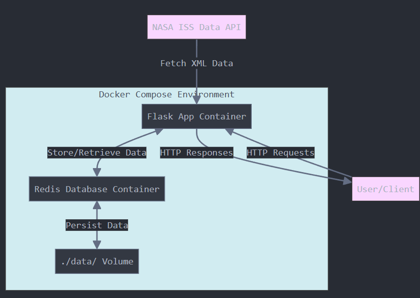

# International Space Station (ISS) Tracker API

## Project Overview

This Flask-based web application provides a RESTful API for accessing real-time position and velocity data of the International Space Station. By transforming NASA's public XML data feed into structured HTTP endpoints, users can programmatically access the ISS's location, making it valuable for space enthusiasts, educational purposes, and research projects focused on space tracking.

The application now features Redis for data persistence and Docker Compose for simplified deployment of the multi-container application.

## Data Source

The application uses NASA's public ISS coordinate data, available in XML format at:
```
https://nasa-public-data.s3.amazonaws.com/iss-coords/current/ISS_OEM/ISS.OEM_J2K_EPH.xml
```

This XML feed contains state vectors including epoch timestamps, position coordinates (X, Y, Z), and velocity components (X_DOT, Y_DOT, Z_DOT) for the ISS. NASA regularly updates this data to provide current tracking information.

## System Architecture



The application has four main components:

1. **ISSTracker Class**: Core functionality for fetching, parsing, and analyzing ISS data
2. **Flask API**: Provides HTTP endpoints to access the data
3. **Redis Database**: Stores the parsed ISS data for persistence and efficient retrieval
4. **Docker Compose**: Orchestrates the Flask and Redis containers

## Prerequisites

To run this application, you'll need:
- Docker and Docker Compose installed on your system
- Internet connection to access the NASA data feed
- Git for cloning the repository

## Deploying with Docker Compose

1. Clone the repository:
```bash
git clone <repository-url>
cd iss-tracker
```

2. Start the application using Docker Compose:
```bash
docker compose up -d
```

This command will:
- Build the Flask application container using the Dockerfile
- Pull the official Redis image from Docker Hub
- Start both containers with the proper configuration
- Create a data directory for Redis persistence
- Connect the containers via a Docker network

## API Endpoints

### Get All ISS Position Data

**Endpoint:** `/epochs`  
**Method:** GET  
**Description:** Returns the entire dataset containing all state vectors.

```bash
curl http://localhost:5000/epochs
```

### Get ISS Position Data with Pagination

**Endpoint:** `/epochs?limit=<int>&offset=<int>`  
**Method:** GET  
**Description:** Returns a subset of the data based on the limit and offset parameters.

```bash
curl "http://localhost:5000/epochs?limit=10&offset=5"
```

### Get Specific Epoch Data

**Endpoint:** `/epochs/<epoch>`  
**Method:** GET  
**Description:** Returns the complete state vector (position and velocity data) for a specific epoch.

```bash
curl http://localhost:5000/epochs/2024-079T12:00:00.000Z
```

### Get Speed for Specific Epoch

**Endpoint:** `/epochs/<epoch>/speed`  
**Method:** GET  
**Description:** Returns the instantaneous speed calculated from the velocity vectors for a specific epoch.

```bash
curl http://localhost:5000/epochs/2024-079T12:00:00.000Z/speed
```

### Get Location for Specific Epoch

**Endpoint:** `/epochs/<epoch>/location`  
**Method:** GET  
**Description:** Returns the latitude, longitude, altitude, and geoposition for a specific epoch.

```bash
curl http://localhost:5000/epochs/2024-079T12:00:00.000Z/location
```

### Get Current ISS Data

**Endpoint:** `/now`  
**Method:** GET  
**Description:** Returns the speed, latitude, longitude, altitude, and geoposition for the epoch closest to the current time.

```bash
curl http://localhost:5000/now
```

## Understanding the Output

### Epoch Timestamps

Epochs are provided in the format `YYYY-DDDT00:00:00.000Z` where:
- `YYYY` is the year
- `DDD` is the day of the year (001-366)
- `T00:00:00.000Z` is the time in UTC

Example: `2024-079T12:00:00.000Z` represents the 79th day of 2024 at 12:00:00 UTC.

### State Vectors

State vectors contain:
- `epoch`: The timestamp for this data point
- `position`: The ISS's position in space with x, y, and z coordinates in kilometers
- `velocity`: The ISS's velocity components x_dot, y_dot, and z_dot in kilometers per second

### Speed Calculation

Speed is calculated using the Pythagorean theorem applied to the three velocity components:

```
speed = sqrt(x_dot² + y_dot² + z_dot²)
```

The resulting speed is in kilometers per second (km/s).

### Location Calculation

The application converts Cartesian coordinates (X, Y, Z) to spherical coordinates (latitude, longitude, altitude) using mathematical transformations. The geoposition is determined using the GeoPy library, which provides location information (country, region, etc.) based on latitude and longitude.

## Example API Responses

### `/epochs/<epoch>` Response:
```
{
  'epoch': '2024-079T12:00:00.000Z',
  'position': {
    'x': -5957.3,
    'y': 3012.1,
    'z': -1158.7
  },
  'velocity': {
    'x_dot': 5.3836,
    'y_dot': -3.7658,
    'z_dot': -3.3285
  }
}
```

### `/epochs/<epoch>/speed` Response:
```
{
  'epoch': '2024-079T12:00:00.000Z',
  'speed': 7.3522
}
```

### `/epochs/<epoch>/location` Response:
```
{
  'epoch': '2024-079T12:00:00.000Z',
  'latitude': 10.2364,
  'longitude': 153.1279,
  'altitude': 408.2,
  'geoposition': 'Pacific Ocean, 200km east of Papua New Guinea'
}
```

### `/now` Response:
```
{
  'epoch': '2024-079T12:00:00.000Z',
  'speed': 7.3522,
  'latitude': 10.2364,
  'longitude': 153.1279,
  'altitude': 408.2,
  'geoposition': 'Pacific Ocean, 200km east of Papua New Guinea'
}
```

## Running Tests

To run the unit tests for the application:

```bash
docker-compose exec flask pytest test_iss_tracker.py
```

## Implementation Notes

- **Redis Integration**: The application now uses Redis for data persistence, ensuring that data remains available across container restarts
- **Data Loading Flow**:
  - On startup, the Flask app checks if data exists in Redis
  - If no data exists, it fetches from NASA's API and loads it into Redis
  - All subsequent data access happens through Redis
- **Environment Variables**: Redis connection parameters can be configured through environment variables
- **Error Handling**: Robust error handling for Redis connection issues and invalid API requests
- **GeoPy Integration**: Added GeoPy for converting coordinates to human-readable location names

## File Structure

```
ISS-Tracker/
├── Dockerfile
├── README.md
├── diagram.png
├── docker-compose.yml
├── iss_tracker.py
├── requirements.txt
└── test_iss_tracker.py
```


## AI Statement

The core analysis and test code, Dockerfile, Docker Compose yaml, and redis additions were written manually. This README and code snippets to Mock the redis(first portion of test py file) and to generate a readable version of the datetime objects(Lines 39-40, 50) were generated by AI. This was done because it was able to write this summary better than I ever could and also generated a sample XML file and was great for learning how to mock the request to the API. I also asked for suggestions on where I should add error handling and logging for the flask routes.